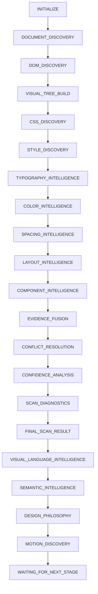

# Visuome (v0.5.1) - KINETIC-STABLE

**Decode any website’s visual system. Turn inspiration into precise design direction.**

Visuome is a local-first Chrome Extension (Manifest V3) that inspects the visible portion of the active webpage and turns real computed CSS into an evidence-backed design blueprint. It extracts color, typography, spacing, radius, border, shadow, layout, component, motion, density, accessibility, and hierarchy signals, then creates prompt-ready outputs for design and implementation tools.

The platform operates with a zero-AI, browser-native local intelligence pipeline to enforce 100% data privacy.

---

## Staging & Pipeline Flow

The scanning process propagates through 22 sequential stages:



---

## Registry Overview

Discovered design elements are compiled into independent, immutable data structures:
* **Node Registry:** Flat index mapping elements to DOM metadata.
* **Style Registry:** Computed and inline CSS metrics per selector.
* **Tokens Registries (Typography, Color, Spacing, Layout):** Normalized values representing layout hierarchies.
* **Semantic & Philosophy Registries:** Higher-level visual language interpretation models.
* **Motion Registry:** Tracks animations, triggers, and technologies telemetry.

---

## Folder Structure

```text
visuome/
├── manifest.json
├── package.json
├── index.html
├── postcss.config.js
├── tailwind.config.js
├── vite.config.js
├── README.md
├── CHANGELOG.md
├── docs/
│   └── adr/
│       └── ADR-0005-Stabilization.md
├── scripts/
│   ├── generateIcons.mjs
│   ├── serveDist.mjs
│   ├── validateBuild.mjs
│   └── healthCheck.mjs
└── src/
    ├── background/
    │   └── serviceWorker.js
    ├── content/
    │   └── contentScript.js
    ├── core/
    │   ├── EventBus.js
    │   ├── ModuleRegistry.js
    │   ├── PipelineEngine.js
    │   ├── ScanSession.js
    │   ├── ScannerEngine.js
    │   ├── ArchitectureValidator.js
    │   ├── models/
    │   │   ├── Evidence.js
    │   │   └── ScanResult.js
    │   ├── visual-language/
    │   ├── semantic/
    │   ├── design-philosophy/
    │   ├── motion/
    │   └── motion-intelligence/
```

---

## Development Workflow

1. Install local dependencies:
   ```bash
   npm install
   ```
2. Build the production extension:
   ```bash
   npm run build
   ```
3. Run verification check tests:
   ```bash
   npm run check
   ```
4. Perform architecture health check:
   ```bash
   node scripts/healthCheck.mjs
   ```

---

## Versioning Policy

We strictly adhere to Semantic Versioning (`MAJOR.MINOR.PATCH`).
* **Major:** Architectural changes or pipeline restructures.
* **Minor:** Feature enhancements or additional analyzers.
* **Patch:** Diagnostics updates, optimizations, or documentation.
